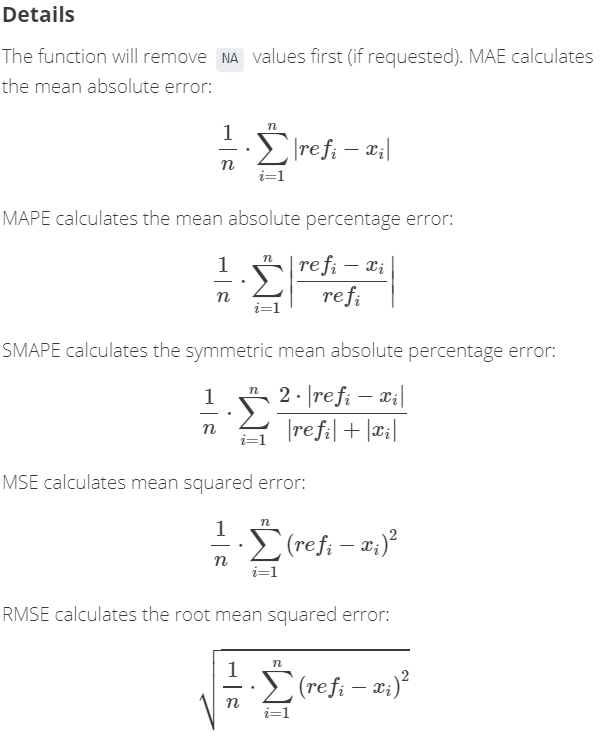

I will be using dataset from first project `Moneyball`, to demonstrate various `imputining` techniques for missing data. For the purpose of this discussion, I will using `knnImputation` function from `DMwR` package.

####Load Data

```{r, echo=T, message=F, warning=F}
library(knitr)    # Report display, table format
library(kableExtra)
library(reshape2)
library(tidyverse)
library(DMwR)

BaseballDf <- read.csv("D:\\CUNY\\621\\Project01\\moneyball-training-data.csv", header= TRUE, stringsAsFactors = F)
BaseballDf$TEAM_BATTING_1B = BaseballDf$TEAM_BATTING_H - BaseballDf$TEAM_BATTING_2B - BaseballDf$TEAM_BATTING_3B - BaseballDf$TEAM_BATTING_HR

BaseballDf_o <- BaseballDf %>% 
  select(TARGET_WINS, TEAM_BATTING_2B,TEAM_BATTING_3B,TEAM_BATTING_HR,TEAM_BATTING_BB,TEAM_BATTING_SO,TEAM_BASERUN_SB,TEAM_PITCHING_H,TEAM_PITCHING_SO,TEAM_FIELDING_E,TEAM_FIELDING_DP,TEAM_BATTING_1B)

BaseballDf_o[!complete.cases(BaseballDf_o),] %>% 
  kable("html",caption = "Rows With Missing Values") %>%
  kable_styling(bootstrap_options = c("striped", "hover", "condensed", "responsive"), full_width = F, position = "left", font_size = 12) %>%
  scroll_box(width = "100%", height = "200px")


apply(BaseballDf_o, 2, function(x) sum(is.na(x))) %>% 
  melt() %>% 
  rownames_to_column() %>% 
  kable("html", caption = "Missing Value Count", col.names = c("Variable", "Count")) %>% 
    kable_styling(bootstrap_options = c("striped", "hover", "condensed", "responsive"), full_width = F, position = "left", font_size = 12)

```

Above table displays columns missing data. I will working with `TEAM_BATTING_SO`.

####Imputation With Mean

Lets work with one variable `TEAM_BATTING_SO`. 

- Remove all the missing value rows from the dataset and create training dataset
- Update 40 with `NA` values.
- Update `NA` values with `Mean`
- Run accuracy test using `regr.eval` function from `DMwR` package.

```{r, echo=T, message=F, warning=F}
options(scipen=10, digits=10)

set.seed(100)
BaseballDf_NA <- BaseballDf_o[complete.cases(BaseballDf_o),]
BaseballDf_NA[sample(1:nrow(BaseballDf_NA), 40), "TEAM_BATTING_SO"] <- NA

missing.row <- BaseballDf_NA[!complete.cases(BaseballDf_NA),]

BaseballDf_NA[!complete.cases(BaseballDf_NA),] %>% 
  kable("html",caption = "Manually Updated NA Rows") %>%
  kable_styling(bootstrap_options = c("striped", "hover", "condensed", "responsive"), full_width = F, position = "left", font_size = 12) %>%
  scroll_box(width = "100%", height = "200px")


BaseballDf_NA$TEAM_BATTING_SO[is.na(BaseballDf_NA$TEAM_BATTING_SO)] <- mean(BaseballDf_NA$TEAM_BATTING_SO, na.rm = T)

BaseballDf_NA[rownames(missing.row),] %>% 
  kable("html",caption = "Manually Updated NA Rows - Mean") %>%
  kable_styling(bootstrap_options = c("striped", "hover", "condensed", "responsive"), full_width = F, position = "left", font_size = 12) %>%
  scroll_box(width = "100%", height = "200px")

actuals <- BaseballDf_o[rownames(missing.row),]$TEAM_BATTING_SO
predicteds <- BaseballDf_NA[rownames(missing.row),]$TEAM_BATTING_SO
regr.eval(actuals, predicteds)

Accuracy <- data.frame(regr.eval(actuals, predicteds), stringsAsFactors = F) %>% 
  rbind('Impute' = "Mean") %>% 
  t() 
```

Results of `mae`, `mse` and `rmse` are very high. Ideal values should be close to `zero`.

####Imputation With Median

- Copy original dataset 
- Remove all the missing value rows from the dataset and create a training dataset
- Update 40 with `NA` values.
- Update `NA` values with `Median`
- Run accuracy test using `regr.eval` function from `DMwR` package.

```{r, echo=T, message=F, warning=F}
options(scipen=10, digits=10)

BaseballDf_NA[rownames(missing.row),]$TEAM_BATTING_SO <- NA
BaseballDf_NA$TEAM_BATTING_SO[is.na(BaseballDf_NA$TEAM_BATTING_SO)] <- median(BaseballDf_NA$TEAM_BATTING_SO, na.rm = T)

BaseballDf_NA[rownames(missing.row),] %>% 
  kable("html",caption = "Manually Updated NA Rows - Median") %>%
  kable_styling(bootstrap_options = c("striped", "hover", "condensed", "responsive"), full_width = F, position = "left", font_size = 12) %>%
  scroll_box(width = "100%", height = "200px")

actuals <- BaseballDf_o[rownames(missing.row),]$TEAM_BATTING_SO
predicteds <- BaseballDf_NA[rownames(missing.row),]$TEAM_BATTING_SO
regr.eval(actuals, predicteds)

A <- data.frame(regr.eval(actuals, predicteds), stringsAsFactors = F) %>% 
  rbind('Impute' = "Median") %>% 
  t()

Accuracy <- rbind(Accuracy,A)

```

Results of `mae` are better than obtained for `Mean` but still high. Values are close to `Mean`.

####Imputation With Mode

- Copy original dataset 
- Remove all the missing value rows from the dataset and create a training dataset
- Update 40 with `NA` values.
- Update `NA` values with `Mode`
- Run accuracy test using `regr.eval` function from `DMwR` package.

```{r, echo=T, message=F, warning=F}
options(scipen=10, digits=10)

getmode <- function(v) {
   uniqv <- unique(na.omit(v))
   uniqv[which.max(tabulate(match(v, uniqv)))]
}


BaseballDf_NA[rownames(missing.row),]$TEAM_BATTING_SO <- NA
BaseballDf_NA$TEAM_BATTING_SO[is.na(BaseballDf_NA$TEAM_BATTING_SO)] <- getmode(BaseballDf_NA$TEAM_BATTING_SO)

BaseballDf_NA[rownames(missing.row),] %>% 
  kable("html",caption = "Manually Updated NA Rows - Mode") %>%
  kable_styling(bootstrap_options = c("striped", "hover", "condensed", "responsive"), full_width = F, position = "left", font_size = 12) %>%
  scroll_box(width = "100%", height = "200px")

actuals <- BaseballDf_o[rownames(missing.row),]$TEAM_BATTING_SO
predicteds <- BaseballDf_NA[rownames(missing.row),]$TEAM_BATTING_SO
regr.eval(actuals, predicteds)

A <- data.frame(regr.eval(actuals, predicteds)) %>% 
  rbind('Impute.Method' = "Mode") %>% 
  t()

Accuracy <- rbind(Accuracy,A)

```

Results of `mae` increased compared to `Mean` and `Mode` but still high. `mape` value went up.

####Imputation With kNN Method

```{r, echo=T, message=F, warning=F}
options(scipen=10, digits=10)
BaseballDf_NA[rownames(missing.row),]$TEAM_BATTING_SO <- NA
BaseballDf_NA <- knnImputation(BaseballDf_NA, 15, meth='weighAvg')
BaseballDf_NA$TEAM_BATTING_SO <- as.numeric(as.character(BaseballDf_NA$TEAM_BATTING_SO))

BaseballDf_NA[rownames(missing.row),] %>% 
  kable("html",caption = "Manually Updated NA Rows - kNN") %>%
  kable_styling(bootstrap_options = c("striped", "hover", "condensed", "responsive"), full_width = F, position = "left", font_size = 12) %>%
  scroll_box(width = "100%", height = "200px")

actuals <- BaseballDf_o[rownames(missing.row),]$TEAM_BATTING_SO
predicteds <- BaseballDf_NA[rownames(missing.row),]$TEAM_BATTING_SO
regr.eval(actuals, predicteds)

A <- data.frame(regr.eval(actuals, predicteds)) %>% 
  rbind('Method' = "kNN") %>% 
  t()

Accuracy <- rbind(Accuracy,A)
```

Compared to `Mean`, `Median` and `Mode`, `kNN` yields better results.

```{r, echo=T, message=F, warning=F}
options(scipen=10, digits=10)
Accuracy <- data.frame(Accuracy, stringsAsFactors=F)
Accuracy$mae <- as.numeric(Accuracy$mae)
Accuracy$mse <- as.numeric(Accuracy$mse)
Accuracy$rmse <- as.numeric(Accuracy$rmse)
Accuracy$mape <- as.numeric(Accuracy$mape)
row.names(Accuracy) <- NULL

Accuracy %>% 
  select(Impute,mae,mse,rmse,mape) %>% 
  kable(digits = 4, "html", caption = "Accuracy Results") %>% 
    kable_styling(bootstrap_options = c("striped", "hover", "condensed", "responsive"), full_width = F, position = "left", font_size = 12)

```



Where $ref_i$ is observed true value and $x_i$ is predicted value. Ideally, difference these two values should be equal to `zero`. Since we are predicting, we cannot attain `zero`. It leaves us the only option, lower the better.

####Linear Models

####Using Mean

```{r, echo=T, message=F, warning=F}
BaseballDf_Mean <- BaseballDf_o %>% select(everything())

for(i in 1:ncol(BaseballDf_Mean)){
  BaseballDf_Mean[is.na(BaseballDf_Mean[,i]), i] <- mean(BaseballDf_Mean[,i], na.rm = TRUE)
}

lm.mb <- lm(TARGET_WINS ~ TEAM_BATTING_2B + TEAM_BATTING_3B + TEAM_BATTING_HR + TEAM_BATTING_BB + TEAM_BATTING_SO + TEAM_BASERUN_SB +  TEAM_PITCHING_SO + TEAM_FIELDING_E + TEAM_FIELDING_DP + TEAM_BATTING_1B, data = BaseballDf_Mean)

summary(lm.mb)

```

####Using Median

```{r, echo=T, message=F, warning=F}
BaseballDf_Median <- BaseballDf_o %>% select(everything())

for(i in 1:ncol(BaseballDf_Median)){
  BaseballDf_Median[is.na(BaseballDf_Median[,i]), i] <- mean(BaseballDf_Median[,i], na.rm = TRUE)
}

lm.mb <- lm(TARGET_WINS ~ TEAM_BATTING_2B + TEAM_BATTING_3B + TEAM_BATTING_HR + TEAM_BATTING_BB + TEAM_BATTING_SO + TEAM_BASERUN_SB + TEAM_PITCHING_SO + TEAM_FIELDING_E + TEAM_FIELDING_DP + TEAM_BATTING_1B, data = BaseballDf_Median)

summary(lm.mb)

```

####Using Mode

```{r, echo=T, message=F, warning=F}
BaseballDf_Mode <- BaseballDf_o %>% select(everything())

for(i in 1:ncol(BaseballDf_Mode)){
  BaseballDf_Mode[is.na(BaseballDf_Mode[,i]), i] <- getmode(BaseballDf_Mode[,i])
}

lm.mb <- lm(TARGET_WINS ~ TEAM_BATTING_2B + TEAM_BATTING_3B + TEAM_BATTING_HR + TEAM_BATTING_BB + TEAM_BATTING_SO + TEAM_BASERUN_SB + TEAM_PITCHING_SO + TEAM_FIELDING_E + TEAM_FIELDING_DP + TEAM_BATTING_1B, data = BaseballDf_Mode)

summary(lm.mb)

```

####Using kNN

```{r, echo=T, message=F, warning=F}
BaseballDf_kNN <- BaseballDf_o %>% select(everything())

BaseballDf_kNN <- knnImputation(BaseballDf_kNN, 15, meth='weighAvg')

for(i in 1:ncol(BaseballDf_kNN)){
  BaseballDf_kNN[is.na(BaseballDf_kNN[,i]), i] <- as.numeric(as.character(BaseballDf_kNN[is.na(BaseballDf_kNN[,i]), i]))
}

BaseballDf_NA$TEAM_BATTING_SO <- as.numeric(as.character(BaseballDf_NA$TEAM_BATTING_SO))

lm.mb <- lm(TARGET_WINS ~ TEAM_BATTING_2B + TEAM_BATTING_3B + TEAM_BATTING_HR + TEAM_BATTING_BB + TEAM_BATTING_SO + TEAM_BASERUN_SB + TEAM_PITCHING_SO + TEAM_FIELDING_E + TEAM_FIELDING_DP + TEAM_BATTING_1B, data = BaseballDf_kNN)

summary(lm.mb)

```

$R^2$ value for `kNN` imputed dataset is better than other three models. It opens up many other options. We can use `SVN`, `Random Forest`, `Maximum Entropy` methods. Also, we can use `confusion matrix` to fine tune the method before applying to the dataset.

####References

- https://www.tutorialspoint.com/r/r_mean_median_mode.htm
- https://www.rdocumentation.org/packages/DescTools/versions/0.99.19/topics/Measures%20of%20Accuracy
- https://www.analyticsvidhya.com/blog/2016/03/tutorial-powerful-packages-imputing-missing-values/
- https://datascienceplus.com/missing-value-treatment/
